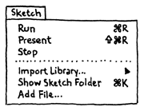

> ## 학습 목표
>
> *   

##  파이썬 프로세싱(Processing) 프로그래밍에 오신 것을 환영합니다.

먼저 [http://processing.org/download](http://processing.org/download) 사이트를 방문해서
여러분이 갖고 있는 컴퓨터에 맞춰서 맥(Mac), 윈도우(Windows) 혹은 리눅스(Linux) 버젼을 선택하세요.
각 컴퓨터에 설치하는 것은 쉽습니다. 다음을 따라하세요.

- 윈도우에서 다운로드 받으면 `.zip` 파일이 생긴다. 
두번 클릭해서 압축을 풀어 하드디스크 내부 폴더에 끌어 놓는다.
폴더 위치는 `Program Files` 혹은 바탕화면도 될 수 있다. 하지만,
중요한 것은 `.zip` 파일에서 프로세싱(processing) 폴더를 끄집어 내야만 한다.
그리고 나서 `processing.exe` 파일을 두번 클릭해서 실행한다.  

- Mac OS X 버젼도 `.zip` 파일이다.
두번 클릭해서 압축을 풀어 `Applications` 폴더에 `Processing` 아이콘을 끌어다 놓는다.
만약 타인 컴퓨터를 사용하고 있어서 `Applications` 폴더를 변경할 수 없다면,
바탕화면에 끌어다 놓는다. 그리고 나서 `Processing` 아이콘을 두번 클릭해서 시작한다.  

- 리눅스 버젼은 `.tar.gz` 파일로 대부분 리눅스 사용자에게는 친숙한다.
파일을 `home` 디렉토리에 다운로드하고 나서, 터미널 윈도우(terminal window)를 열고 다음과 같이 타이핑한다;

~~~ {.input}
tar xvfz processing-xxxx.tgz
~~~

여기서 xxxx는 버젼 숫자를 나타낸다. 상기 명령어는 `processing-2.0` 혹은 유사한 폴더 이름을 생성한다.
그리고 나서 해당 디렉토리로 이동하고 난 후 실행한다.

~~~ {.input}
cd processing-xxxx
./processing
~~~

행운이 따르면, 주 프로세싱 윈도우가 이제 보일 것이다. 
각자 컴퓨터 환경은 모두 다르기 때문에, 만약 프로그램이 시작되지 않는다면,
어딘가 문제가 있는 것이다. 
가능한 해결책은 [문제해결(troubleshooting) 페이지](http://wiki.processing.org/w/Troubleshooting)를 참조한다.

## 파이썬 모드 (Python Mode)

프로세싱은 그 자체로 파이썬 프로그래밍 언어 지원을 포함하고 있지는 않다.
파이썬 언어를 활성화시키기 위해서 `Python Mode`로 불리는 추가모듈(add-on)을 설치해야 한다. 
툴바 오른쪽 드롭다운 메뉴를 클릭하고 `Add Mode...`를 선택해서 파이썬을 사용할 수 있다.
`Mode Manager` 윈도우가 나타날 것이다. `Python`을 볼때까지 스크롤 다운(scroll down)해서 `install`을 누른다.
[좀더 자세한 정보는 여기](https://github.com/jdf/processing.py#python-mode-for-processing)서 확인한다.

파이썬 모드(Python Mode)를 파이썬 모드를 설치한 다음에,
툴바에 드롭다운 메뉴를 사용해서 프로세싱 자바와 파이썬 버젼을 오갈 수 있다.
만약 프로그램을 실행해서 구문오류나 예외사항이 발생되면, 올바른 모드(mode)를 선택했는지 우선적으로 확인한다.

## 첫번째 프로그램

이제 파이썬 모드가 설치된 프로세싱 개발 환경 (Processing Development Environment, PDE)이 준비되었다.
지금으로서 그다지 할 것이 눈에 보이지 않는다; 큰 화면에 텍스트 편집기와 상단에 일련의 버튼만 있는데 툴바라고 한다.
편집기 하단은 메시지 영역(Message Area)이고 그 밑에 콘솔(console)이 있다.
메시지 영역은 한줄 메시지를 위해 사용되고, 콘솔은 좀더 기술적인 세부사항을 담기 위해 사용된다.

편집기에 다음 명령어를 타이핑한다.

~~~ {.python}
ellipse(50, 50, 80, 80);
~~~

한줄 코드가 의미하는 바는 "타원을 그려라. 타원은 왼쪽에서 50 픽셀, 위에서 50픽셀 아래로 중심이 갖는다. 폭과 길이는 각각 80 픽셀이다." 다음과 같은 실행버튼(Run Button)을 클릭한다.

만약 모두 올바르게 타이핑했다면, 화면 윈도우(Display Window)에 다음이 나타날 것이다.

만약 올바르게 타이핑하지 않으면, 메시지 영역(Message Area)가 붉은색으로 변하고 오류를 뱉어낸다.
만약 이런 사건이 발생하면, 침작하게 상기 예제 코드를 복사해서 확실히 한다; 숫자는 괄호 내부에 담겨있어야 하고, 각 숫자는 콤마로 구분되고, 세미콜론으로 끝나야 된다. 하지만, 파이썬은 세미콜론을 생략한다.

프로그램을 시작한는데 있어서 가장 어려운 것 중 하나는 구문(syntax)에 대해서 매우 구체적이고 엄격해야 된다는 것이다.
프로세싱 소프트웨어는 프로그래머가 의도한 바를 알아차릴 정도로 충분히 똑똑하지 않다.
구두점 위치에 대해서도 혼란스러울 수 있다. 
약간의 실습을 통해서 곧 익숙해질 것이다.

다음으로, 좀 건너뛰어서 약간더 흥미로운 스케치로 넘어간다. 마지막 예제 텍스트 코드를 지우고 다음을 타이핑한다:

~~~ {.python}
def setup():
    size(480, 120)

def draw():
    if  mousePressed:
        fill(0)
    else:
        fill(255)
    ellipse(mouseX, mouseY, 80, 80)
~~~

상기 프로그램은 가로세로 480, 높이 120 픽셀을 갖는 윈도우를 생성한다.
그리고 나서, 마우스 위치에 흰색 원을 그린다.
마우스 버튼이 클릭되면, 원 색깔이 검정색으로 변경된다. 
나중에 좀더 자세하게 프로그램 구성요소에 관해서 설명할 것이다.
지금은, 코드를 실행하서 마우스를 이동하고, 클릭해서 프로그램을 경험한다.

**주목**: 파이썬 프로그램 코드 각 줄을 들여쓰기 하는데 주의한다.
들여쓰기는 파이썬에서 중요하다. 올바르지 않게 혹은 일관성 없이 들여쓰기 하면 의도한 바와 다르게
프로그램이 동작되거나 전혀 동작을 않할 수도 있다.
사용하는 공백 숫자가 일관되기만 한다면 임의 숫자 공백도 사용할 수 있다.
(많은 파이썬 프로그래머는 공백 4개를 선호한다. 다른 프로그래머는 공백 2개를 선호한다.)
코드를 들여쓰기하는데 탭(tab)키를 사용할 수도 있지만, 
탭을 절대 사용하지마라. 들여쓰기에는 공백을 사용한다.

## 보여주기(Show)

아마도 실행버트 옆에 정지버튼이 무엇을 수행하는지 궁금했을 수도 있지만, 지금까지 실행버튼을 다루었다. 

만약 버튼을 사용하고자 하지 않는다면, `Run(실행)`하는데 `Sketch` 메뉴를 항상 사용할 수도 있다.
단축키 `Ctrl+R` (Mac에서는 `Cmd+R`)을 누르면 `Sketch` 메뉴가 나타난다.

`Sketch` 메뉴 아래에 `Present`가 있는데 스케치 그자체를 보여주려고 나머지 화면 모두를 깨끗이 한다.

또한 툴바에서 'Run' 버튼을 클릭할 때 쉬프트키를 함께 눌러 `Present`를 사용할 수도 있다.

## 저장하기(Save)

중요한 다음 명령어는 `Save`(저장하기)다.  툴바에서 아래로 향하는 화살표로 되어 있다.

`File` 메뉴 아래서 찾을 수 있다. 기본 설정으로, 작성한 프로그램은 `sketchbook`에 저장된다.
쉽게 접근할 수 있게 작성한 프로그램을 모아두는 폴더다.
툴바에 `Open`(열기) 버튼(위로 향하는 화살표)은 `sketchbook`에 있는 모든 스케치 목록과 더불어 
프로세싱 소프트웨어에 설치된 예제 목록을 가져다 준다.

항상 스케치를 자주 저장하는 것은 좋은 생각이다.
다른 것을 시도할 때, 다른 이름을 부여해서 저장하라. 
그래서, 항상 이전 버젼으로 언제라도 돌아갈 수 있다.
특히 도움이 될 때는 만약 프로그램이 동작하지 않을 때다.
`Sketch` 메뉴 아래 `Show Sketch Folder`에 스케치가 위치한 디스크 장소를 볼 수 있다.

또한 툴바에 'New' 버튼을 눌러서 새로운 스케치를 생성할 수도 있다.

## 예제와 참조문서

프로세싱과 파이썬으로 프로그램을 작성하는 방법을 배우는 것은 수많은 코드 탐색과정을 포함한다;
코드를 변형해서 새로운 뭔가로 만들기까지 실행하고, 변경하고, 쪼개고, 기능을 향상하는 과정이다.
이것을 염두에 두고서, 프로세싱 소프트웨어에 수십개 예제를 포함해서 소프트웨어의 다양한 기능을 시연한다.
예제 프로그램을 열기 위해서, `File` 메뉴에서 `Example`을 선택하거나 `PDE`에서 `Open` 아이콘을 클릭한다.
예제 프로그램은 기능별로 구룹지어서 구분되어 있다. 예를 들어, 형태, 모션, 이미지.
목록에서 흥미로운 주제를 찾아 예제로 시험해보라.

프로세싱 참조문서(Processing Reference)에는 모든 코드 요소를 기술하고 예제를 들어 설명하고 있다.
참조문서 프로그램은 훨씬 짧고 (통상 4 혹은 5줄), 예제 폴더에 있는 긴 코드보다 따라가기가 더 쉽다.
프로세싱 책을 읽거나 프로그램을 작성할 때 참조문서를 열어놓고 작업하는 것을 추천한다.
참조문서는 주제별로 혹은 알파벳순으로 찾아볼 수 있다; 종종 브라우져 윈도우에서 텍스트 검색을 하는 것이 더 빠르다.

참조문서는 초심자를 염두에 두고 작성되었다; 명확하고 이해하기 쉽도록 작성되었으면 한다.
수년에 걸쳐서 오류를 찾아내고 보고해 주신 수많은 분들께 감사의 말씀을 전한다. 만약 참조문서 항목을 향상하거나 오류를 발견하면, 각 참조문서 페이지 상단에 있는 링크를 클릭해서 알려주기 바란다.

